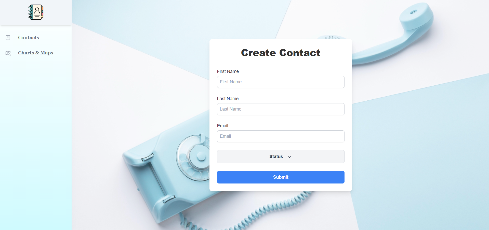
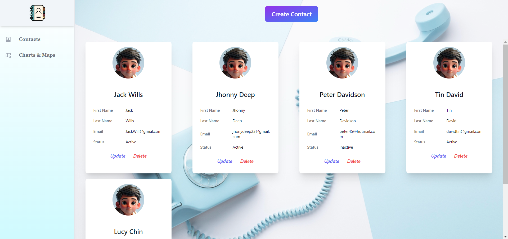
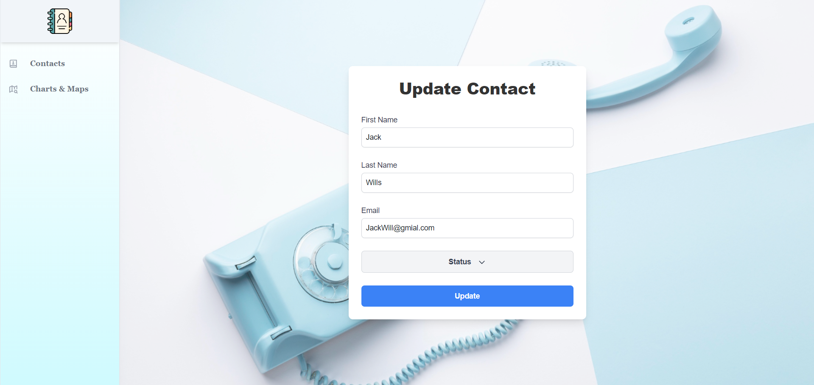
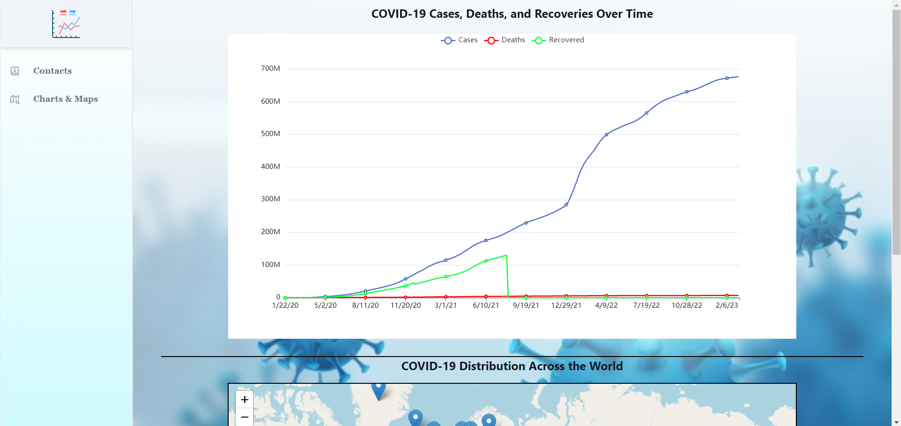
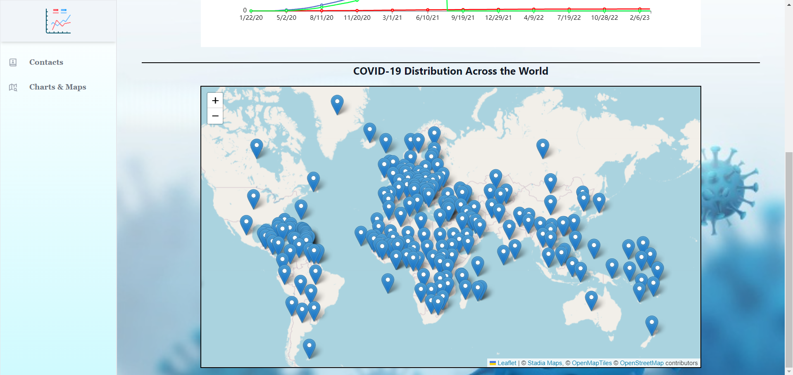

# Contact Management & COVID Insights

## Description

**Contact Management & COVID Insights** is a web application that combines contact management with COVID-19 data visualization. It allows users to manage contacts by adding, updating, and deleting them, as well as view visualizations of COVID-19 cases, deaths, and recoveries over time, along with their distribution across the world.

## Deployment Link
[https://covinsights.netlify.app/](https://covinsights.netlify.app/)

## Features
- **Interactive Line Chart:** Users can toggle between different data lines (cases, deaths, and recovered) by clicking on the legend items. Detailed counts are shown on hover.
- **Interactive Map:** The map displays markers for each country. Clicking on a marker shows a popup with the country's COVID-19 data, including active cases, recovered cases, deaths, and the country's flag.
- **Contacts Management:** Manage contacts by adding, updating, and deleting them.
- **Charts & Maps:** View visualizations of COVID-19 cases, deaths, and recoveries over time, as well as distribution across the world.
- **Responsive Design:** The application is designed to be responsive and works well on different devices.

## Technologies Used

- **React.js**
- **React Router DOM**
- **Redux Toolkit**
- **Tanstack React Query**
- **Leaflet for mapping**
- **ECharts for charting**
- **Tailwind CSS for styling**
- **Axios for HTTP requests**

## Installation

1. Clone the repository:
   ```bash
   git clone --branch dev https://github.com/rahul-kachhwah/Contact_Managment_And_Covid_Insights.git
   ```
2. Navigate to the project directory:
   ```bash
   cd Contact_Managment_And_Covid_Insights
   ```
3. Install dependencies:
   ```bash
   npm install
   ```

## Usage

1. Start the development server:
   ```bash
   npm run dev
   ```
2. Open your browser and go to: [http://localhost:5173](http://localhost:5173)

## Pages and Functionality

### Contacts

This page allows you to manage your contacts. You can add a new contact by filling out the form, and the contact will be added to the list. You can also edit or delete an existing contact. Clicking on a contact's name will take you to the contact details page.

### Charts and Maps

This page displays COVID-19 data for different countries. It includes a line graph showing the cases fluctuations over time and a map with markers that indicate the country name, total number of active, recovered cases, and deaths in that particular country as a popup.

## APIs Used

The app uses the following APIs to fetch data:

- World wide data of cases: https://disease.sh/v3/covid-19/all
- Country Specific data of cases: https://disease.sh/v3/covid-19/countries
- Graph data for cases with date: https://disease.sh/v3/covid-19/historical/all?lastdays=all

## Screenshots

### Contact Page :-



</br>


</br>


</br>


</br>

### Charts and Maps Page :-



</br>


</br>
